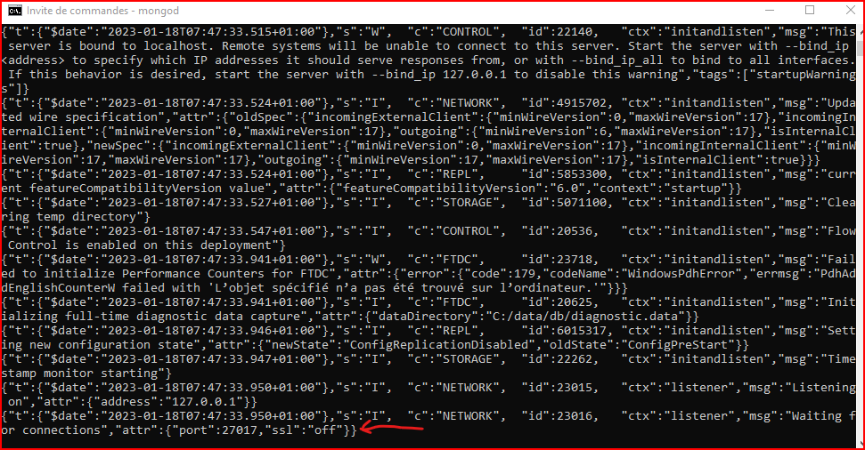
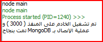
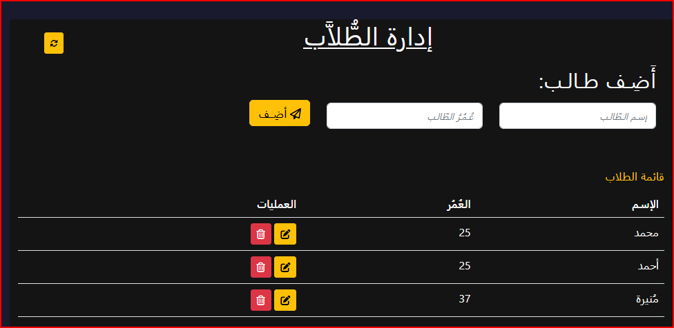

# Description
The student management project is a practical example based on Node.js [(MVC)](https://en.wikipedia.org/wiki/Model%E2%80%93view%E2%80%93controller) architecture. It deal with a MongoDB database with Express and Mongoose modules.

MongoDB is a source-available cross-platform document-oriented database program. Classified as a [NoSQL](https://fr.wikipedia.org/wiki/NoSQL) database program.It uses [JSON](https://en.wikipedia.org/wiki/JSON)-like documents with optional [schemas](https://www.mongodb.com/docs/manual/core/schema-validation/).

----------

# Prerequisites for this project
- Knowledge of Node.js
- Knowledge to master MongoDB.

----------

# Installation
Node.js dowloads:
> [Node.js for windows](https://nodejs.org/en/download/)

> [Linux or other operating systems](https://github.com/nodesource/distributions)

At the beginning and after downloading and installing node.js, we need our database. That's why we will have to go to the official site and [download](https://www.mongodb.com/try/download/community) and [install it](https://www.mongodb.com/docs/manual/installation/) on our machine.

The second step is to [install MongoDB Compass](https://www.mongodb.com/docs/compass/current/install/) (Optional).That's all **:)**.

----------

# Commands
- Starting the server *( Windows command prompt )***:**
"mongod"
- Start our application with node.js *( Editor )***:**
"node main" | "node main.js"
- Go to http://localhost:3000/ on the browser to test

----------

# Screenshots

----------

# Resources
- [Node.js](https://nodejs.org/en/docs/)
- [MongoDB](https://www.mongodb.com/docs/)
- [MongoDBCompass](https://www.mongodb.com/products/compass)
- [Express](https://expressjs.com/)
- [Mongoose](https://mongoosejs.com/)
